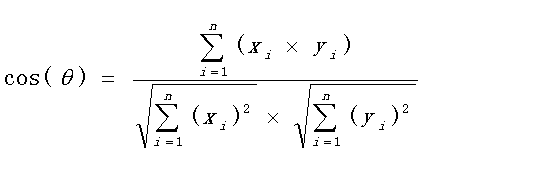

# Similarity Compute

> Multi Version implement of cosine similarity compute algorithm
> 



## Original Vector Version

cpp原始Vector只是一种线性的数据结构，面对高维相似度计算这种问题，计算量会急剧上升

```cpp
bool cos_similarity(const std::vector<float>& a_data,
                        const std::vector<float>& b_data,
                        float & score)
{
    /* -------------------------------------------------------------------------- */
    /*                 cpp vector version cos_similarity function                 */
    /* -------------------------------------------------------------------------- */
    const int data_length = a_data.size();
    double ab_mult_add = 0.0f;
    double a_len = 0.0f;
    double b_len = 0.0f;    

    if((0 != data_length) and (b_data.size() != data_length))
    {
        return false;
    }

	//ab_mult_add:分母
	//sqrt(a_len * b_len) :分子
    for (std::size_t i = 0; i < data_length; i++) 
    {
        ab_mult_add += (a_data[i] * b_data[i]);
        a_len += a_data[i] * a_data[i];
        b_len += b_data[i] * b_data[i];
    }

    score = (float) (ab_mult_add / sqrt(a_len * b_len));
    return true;
}
```


## Solution Eigen:
Eigen的一些特性：
支持整数、浮点数、复数，使用模板编程，可以为特殊的数据结构提供矩阵操作。比如在用ceres-solver进行做优化问题（比如bundle adjustment）的时候，有时候需要用模板编程写一个目标函数，ceres可以将模板自动替换为内部的一个可以自动求微分的特殊的double类型。而如果要在这个模板函数中进行矩阵计算，使用Eigen就会非常方便。
支持逐元素、分块、和整体的矩阵操作。
内含大量矩阵分解算法包括LU，LDLt，QR、SVD等等。
支持使用Intel MKL加速
部分功能支持多线程
稀疏矩阵支持良好，到今年新出的Eigen3.3，已经自带了SparseLU、SparseQR、共轭梯度（ConjugateGradient solver）、bi conjugate gradient stabilized solver等解稀疏矩阵的功能。同时提供SPQR、UmfPack等外部稀疏矩阵库的接口。
支持常用几何运算，包括旋转矩阵、四元数、矩阵变换、AngleAxis（欧拉角与Rodrigues变换）等等。


```cpp
bool eigen_cos_similarity(const Eigen::VectorXf& first,
                             const Eigen::VectorXf& second, float* result) {

    /* -------------------------------------------------------------------------- */
    /*                  cpp eigen version cos_similarity function                 */
    /* -------------------------------------------------------------------------- */
  if (result == nullptr) {
    return false;
  }
  if (first.size() != second.size() || first.size() == 0) {
    return false;
  }
  const float norm = first.norm() * second.norm();
  if (std::abs(norm) < 1e-6) {
    return false;
  }
  *result = first.dot(second) / norm;
  return true;
}
```

## Solution OPENCV:

cv::Mat OpenCV中最基础的数据结构，具有存储多种数据类型的多维矩阵的能力，也可用来表示图像。在CPU端，SIMD (Single instruction, multiple data) 是数值计算常用的加速方式，然而即使是相同架构的CPU，所支持的宽度和指令都不相同，为每一种目标指令集写一份加速代码代价巨大。在OpenCV中，这种差距被其 Universal Intrinsic 的抽象填平了。OpenCV Universal Intrinsic 将不同SIMD指令的向量 (vector) 封装成了统一的数据结构，重载了各种运算符，并将向量宽度描述为一个随编译环境自动变化的变量。从此，开发者不再需要过多关注不同CPU的SIMD指令间的差异，同一套SIMD加速过的代码能够通过不同的编译选项生成对应不同目标指令集的程序。此外，OpenCV的一些方法也提供多线程实现，并允许用户使用cv::parallel_for_()封装自己的方法。
cv::UMat 于OpenCV3.0 引入，T-API (Transparent API) 的基础数据结构。T-API是曾经的OCL模块的替代，旨在允许开发者通过非常简单的代码修改将现有OpenCV程序无缝迁移到OpenCL上，从而利用强大的异构算力获取数倍的加速。
cv::gapi::GMat 于OpenCV4.0引入，G-API (Graph API) 的基础结构。与其他的Mat类不同，GMat并不会存储实际的数据，而是会记录用户对GMat进行的操作，并最终组合多个GMat生成一个计算图用以处理真正的计算。基于图的计算，是G-API的核心思想。计算图将计算式声明与计算分离，可以带来至少两个好处：一是OpenCV可以在内部提供分散函数无法提供的跨函数优化，如算术操作的合并，高速缓存的复用和避免多次分配buffer；二是统一的接口使得用户可以相对简单地选择计算时的后端，如Halide和OCL等。目前G-API仍处于活跃的开发阶段，可能会产生不兼容的改动，建议稳定后再使用。
cv::cuda::GpuMat 顾名思义，GPU上的Mat，代表数据指针指向CUDA的Device memory的二维矩阵，是OpenCV多个CUDA相关模块（均在opencv_contrib）的基础数据结构之一。OpenCV的CUDA模块已经开发了近10年，功能相当丰富，用户能够方便地用其改写现有项目，也能将其数据结构集成到自定义的CUDA Kernel中，实现极致的性能优化。

因此使用opencv的mat以及相关变种 拥有很高的 优化潜力

```cpp
float cv_cos_similarity(const cv::Mat& first,const cv::Mat& second)
{
    /* -------------------------------------------------------------------------- */
    /*               cpp opencv::mat version cos_similarity function              */
    /* -------------------------------------------------------------------------- */
    double dotSum=first.dot(second);//内积
    double normFirst=cv::norm(first);//取模
    double normSecond=cv::norm(second); 
    if(normFirst!=0 && normSecond!=0){
        return dotSum/(normFirst*normSecond);
    }
}
```

## Solution NEON:

Neon is the implementation of Arm's Advanced SIMD architecture.

The purpose of Neon is to accelerate data manipulation by providing:

Thirty-two 128-bit vector registers, each capable of containing multiple lanes of data.
SIMD instructions to operate simultaneously on those multiple lanes of data.
Applications that can benefit from Neon technology include multimedia and signal processing, 3D graphics, speech, image processing, or other applications where fixed and floating-point performance is critical.

As a programmer, there are a number of ways you can make use of Neon technology:

Neon-enabled open source libraries such as the Arm Compute Library provide one of the easiest ways to take advantage of Neon.
Auto-vectorization features in your compiler can automatically optimize your code to take advantage of Neon.
Neon intrinsics are function calls that the compiler replaces with appropriate Neon instructions. This gives you direct, low-level access to the exact Neon instructions you want, all from C, or C++ code.
For very high performance, hand-coded Neon assembler can be the best approach for experienced programmers.
In this guide we will focus on using the Neon intrinsics for AArch64, but they can be compiled for AArch32 also. For more information about AArch32 Neon see Introducing Neon for Armv8-A. First we will look at a simplified image processing example and matrix multiplication. Then we will move on to a more general discussion about the intrinsics themselves.

```cpp

double neon_cos_similarity(const std::vector<float>& a_data,
                         const std::vector<float>& b_data, 
                         float & score)
{
    /* -------------------------------------------------------------------------- */
    /*                  cpp neon version cos_similarity function                  */
    /* -------------------------------------------------------------------------- */
    const int data_length = a_data.size();
    double ab_mult_add = 0.0f;
    double a_len = 0.0f;
    double b_len = 0.0f;    
    // float32x4_t 由4个32位的float组成的数据类型，对它做一次操作，4个float都被用到
    float32x4_t ab_mult_add_vec = vdupq_n_f32(0);// 存储的四个 float32 都初始化为 0，寄存器ab_mult_add_vec
    float32x4_t a_qua_sum_vec = vdupq_n_f32(0);
    float32x4_t b_qua_sum_vec = vdupq_n_f32(0);

    if((0 != data_length) and (b_data.size() != data_length))
    {
        return false;
    }

    float* a_data_ptr = (float*)a_data.data();
    float* b_data_ptr = (float*)b_data.data();
    for (int i = 0; i < data_length / 4; ++i) //四个数据为一组.或有剩余数据,下文处理
    {
        float32x4_t a_data_vec = vld1q_f32(a_data_ptr + 4*i);// 加载 data + 4*i 地址起始的 4 个 float 数据到寄存器tmp_vec
        float32x4_t b_data_vec = vld1q_f32(b_data_ptr + 4*i);
        ab_mult_add_vec += vmulq_f32(a_data_vec, b_data_vec);//点乘 [a0*b0, a1*b1, a2*b2, a3*b3],并累加
        a_qua_sum_vec += vmulq_f32(a_data_vec, a_data_vec);//点乘 [a0*a0, a1*a1, a2*a2, a3*a3],并累加,就是平方和
        b_qua_sum_vec += vmulq_f32(b_data_vec, b_data_vec);
    }
    //将累加结果寄存器中的所有元素相加得到最终累加值
    ab_mult_add += vgetq_lane_f32(ab_mult_add_vec, 0);
    ab_mult_add += vgetq_lane_f32(ab_mult_add_vec, 1);
    ab_mult_add += vgetq_lane_f32(ab_mult_add_vec, 2);
    ab_mult_add += vgetq_lane_f32(ab_mult_add_vec, 3);
    // std::cout << "neon ab_mult_add = " << ab_mult_add  << std::endl;

    a_len += vgetq_lane_f32(a_qua_sum_vec, 0);
    a_len += vgetq_lane_f32(a_qua_sum_vec, 1);
    a_len += vgetq_lane_f32(a_qua_sum_vec, 2);
    a_len += vgetq_lane_f32(a_qua_sum_vec, 3);
    // std::cout << "neon a_len = " << a_len  << std::endl;

    b_len += vgetq_lane_f32(b_qua_sum_vec, 0);
    b_len += vgetq_lane_f32(b_qua_sum_vec, 1);
    b_len += vgetq_lane_f32(b_qua_sum_vec, 2);
    b_len += vgetq_lane_f32(b_qua_sum_vec, 3);
    // std::cout << "neon b_len = " << b_len  << std::endl;

    int odd = data_length & 3;//数组长度除有4余数
    if(0 < odd) 
    {
        //处理剩余数据
        // std::cout << "data_length = " << data_length << ", odd = " << odd << std::endl;
        for(int i = data_length - odd; i < data_length; i++) 
        {
            ab_mult_add += (a_data[i] * b_data[i]);
            a_len += a_data[i] * a_data[i];
            b_len += b_data[i] * b_data[i];
        }
    }

    score = (float) (ab_mult_add / sqrt(a_len * b_len));

    return true;
}


```

